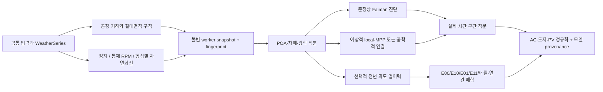

# 3D 태양광 시뮬레이터 아키텍처

기준일: 2026-08-12

> 계산 수치의 권위는 수동 문서가 아니라 [`generated-validation-report-2026.md`](generated-validation-report-2026.md)와 그 보고서가 읽는 감사 JSON이다. 이 문서는 구현 계약만 설명한다.

## 목표와 경계

공식 비교의 질문은 “같은 토지 점유면적에서 형상과 회전이 발전량에 어떤 영향을 주는가”이다. Three.js는 표시와 조작을 담당하고, 기하·복사·열·전기·회전·시간 적분은 React와 렌더 mesh에 의존하지 않는 `src/lib` 및 `src/workers`의 순수 계산 경로가 담당한다. 형상별 출력 multiplier나 특정 논문 순위를 맞추는 보정계수는 사용하지 않는다.

공식 형상은 평면·정육면체·원기둥·구·반구·원뿔이다. 각 형상은 공통 `A_land` 및 `H_max=2√(A_land/π)` 계약을 만족해야 하며, 회전하는 비축대칭 구조의 토지 점유는 한 자세가 아니라 360° swept occupation으로 판정한다. `A_PV`는 해석 표면에서 계산하고 `A_land`와 별도로 보고한다.

## 계산 경로



worker wire contract는 protocol v4, 계산 cache는 v5다. fingerprint에는 기하 표본, 광학·전기·열·인버터 입력, 기상, 장애물, 회전 schedule, 모터 부하와 모델 version이 포함된다. 완료 결과는 request ID, worker identity와 fingerprint가 현재 요청과 모두 맞을 때만 UI에 반영한다.

## 기하와 광학

`src/lib/geometry/comparison-surfaces.ts`가 공통 토지·높이 조건의 해석 형상과 절대면적 구적표본 `(position, normal, areaM2)`을 만든다. `Σ areaM2=A_PV`가 불변식이며 렌더 triangle 수는 적분 해상도를 결정하지 않는다. 정적 footprint, swept footprint, tight bounds와 정비 여유 parcel은 서로 다른 필드다.

표면 좌표는 `+X=동`, `+Y=위`, `+Z=북`을 사용한다. 태양·IAM·직달·산란·Lambert 지면반사는 표본별로 계산하며, 장애물 AABB는 직달광만 가린다. 축대칭 볼록 형상은 방향성 반사와 장애물이 없는 조건에서 세계 Y축 회전에 대해 총 POA가 불변이어야 한다.

## 두 전기 비교 계약

같은 연속 표면 구적 위에서 다음 두 전기 모델을 명시적으로 분리한다.

- `local-mpp-area-integral`: 각 미소면이 독립 MPPT를 갖는 이상적 연속막 상한이다. 전압·전류 mismatch, bypass와 배선 손실이 없는 이론적 상한으로만 해석한다.
- `explicit-series-parallel-bypass`: 동일한 명목 셀 면적 밀도로 셀을 만들고, 셀 직렬·스트링 병렬·bypass substring·배선 저항을 명시해 공통 I–V 운전점을 푼다. 제조사별 실제 레이아웃은 아니지만 local-MPP와 동일한 결과로 표시하지 않는다.

두 경로 모두 전체 DC를 합친 뒤 공통 인버터를 한 번 적용한다. 고정 RPM이 능동 모터 구동이면 `P_motor=τ|ω|/η_motor`를 gross AC에서 차감하고 net AC는 0 아래로 내리지 않는다. 풍력으로 생긴 전기는 계산하지 않는다.

## 열 모델 계약

두 열 결과는 의도적으로 별도 provenance를 가진다.

- 준정상 경로는 각 weather timestamp를 독립적으로 푼다. 이 경로의 행·CSV·집계는 `준정상 광학 회전·열이력 미포함`으로 표시한다.
- 선택적 annual transient 경로는 실제 weather clock 전체에 걸쳐 열상태를 구간 사이에 유지한다. 별도의 저해상도 열노드망에서 열용량, 흡수 일사, 전기 추출, 장파복사, 전·후면 대류, 인접 노드 전도를 적분한다. 회전 대류는 `|u_wind-ω×r|`를 사용하고 warm-up/주기 수렴, 열수지 잔차와 mesh 수렴을 보고한다.

annual transient variant의 authoritative period energy는 complete event의 E11이다. streamed per-weather rows는 계속 준정상 진단이므로 authoritative transient 연간값과 혼합하지 않는다. E00/E10/E01/E11로 `optical`, `thermal`, `interaction`, `net`을 월별·연간 계산하고 2×2 항등식 폐합을 검사한다.

현재 annual transient opt-in은 연속표면 local-MPP에 한정된다. `explicit-series-parallel-bypass`, 외부 장애물, plane tracking과 함께 요청하면 입력 검증에서 거부한다. 이 조합은 임의의 준정상값으로 대체하지 않는다.

## 회전 모델 계약

- 정지: `0 RPM`이다.
- 통제 RPM: 모든 형상에 사용자가 지정한 동일 RPM을 운동학적으로 적용한다. 능동 모터 부하는 별도 AC 원장에 기록한다.
- 자연환경 RPM: 형상별 투영면적, 힘 작용반경, Y축 관성모멘트, 축마찰·공기저항과 `C_Q(λ)` provenance를 사용한다. 각 기상 구간에서 `I·dω/dt=τ_aero(V,ω,shape)-τ_loss(ω)`를 backward Euler로 적분하고, 월·연간 RPM은 구간 시간가중 평균으로 계산한다.

자가기동 `C_Q`가 없는 대칭 형상은 0 RPM이다. 문헌·측정 토크자료가 없을 때 사용자 입력 `C_Q`는 low-confidence sensitivity로만 표시한다. 별도 비대칭 수동 로터를 쓰려면 로터 footprint·높이·음영이 공정 조건에 포함돼야 하며, 누락되면 공식 순위에서 제외한다. 월평균 풍속을 정상상태 토크식에 한 번 넣어 RPM을 만드는 경로는 공식 계약이 아니다.

## 시간 적분과 보고

비윤년은 8,761개 경계점과 8,760개 구간, 윤년은 8,785개 경계점과 8,784개 구간을 요구한다. 마지막 closing endpoint는 상태·구간 경계를 닫지만 별도 발전 구간으로 중복 적분하지 않는다. 월 bucket은 명시된 reporting offset으로 나누며 내부 timestamp 권위는 UTC다.

대표일 분석은 화면 진단과 민감도 탐색에 사용할 수 있으나 실제 전년 worker 적분과 같은 종류의 값으로 순위표에 섞지 않는다. 공식 결과 행은 `A_land`, `A_PV`, `A_PV/A_land`, 총 AC, 토지 생산성, PV 면적당 생산성, 전기·열·회전 모델, 기상 출처, 시간 해상도와 실제 전년/대표일 구분을 함께 가진다.

## 구현 모듈

```text
src/lib/geometry/comparison-surfaces.ts       공정 형상·면적·구적
src/lib/physics/continuous-surface.ts         연속표면 광학·전기 계산
src/lib/physics/engineering-surface-electrical.ts
                                               명시적 셀·스트링·bypass 연결
src/lib/physics/annual-transient.ts           지속 열상태와 E00/E10/E01/E11
src/lib/physics/natural-rotation.ts           형상별 동역학과 시간가중 RPM
src/workers/protocol.ts                       protocol v4/cache v5 결과 계약
src/workers/kernel.ts                         시계열·연간 적분과 원장
src/ui/SimulatorClient.tsx                    입력 snapshot·worker·결과 표시
```

## 감사 산출물

수동 문서에 계산표를 복제하지 않는다. 현재 수치와 판정은 다음 자동 산출물을 따른다.

- [통합 생성 검증 보고서](generated-validation-report-2026.md)
- [실제 전년 비교 감사](full-year-comparison-audit-2026.md)
- [공정 기하 감사](fair-geometry-audit-2026.md)
- [연간 과도 열 감사](annual-transient-audit-2026.json)
- [준정상·과도 열 비교](thermal-model-comparison-audit-2026.md)
- [형상별 자연회전 감사](natural-rotation-audit-2026.md)
- [1차 출처 재현 감사](research-source-equivalent-audit.md)

적용 범위와 미지원 조합은 [알려진 한계](known-limitations.md)를 따른다.
