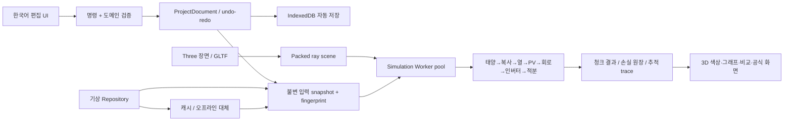

# 3D 태양광 시뮬레이터 아키텍처

## 1. 결정 요약

이 문서는 현재 vinext 스타터를 실제 제품으로 확장할 때 지켜야 할 구현 계약이다.

- 런타임은 **Vite 8 + vinext + React 19 + TypeScript**를 유지한다. `app/page.tsx`는 얇은 서버 셸이고, Three.js와 브라우저 저장소를 쓰는 시뮬레이터는 명시적인 `"use client"` 경계 아래 둔다.
- Three.js는 렌더링·선택·조작에만 사용한다. 발전량은 렌더링 그림자가 아니라 별도 광선 교차 엔진으로 계산한다.
- 물리 계산은 React와 Three.js에 의존하지 않는 순수 TypeScript 코어로 만든다. 공간 교차만 `three-mesh-bvh` 어댑터 뒤에 격리한다.
- 형상 하나는 1~20개 패널, 비교 프로젝트는 1~5개 형상, 전체 최대 100개 패널이라는 불변식을 도메인 검증 단계에서 강제한다. 기본 프리셋은 정확히 20개다.
- 편집 가능한 원본, 일시적인 UI 상태, 계산 결과를 서로 다른 저장소로 분리한다. 계산은 항상 불변 입력 스냅샷으로 실행하며 편집 중인 객체를 직접 참조하지 않는다.
- 순간·일간·월간·연간 및 회로 I-V/P-V 계산은 브라우저 Web Worker에서 실행한다. 배포 진입점인 `worker/index.ts`(Cloudflare Worker)와 계산 워커를 혼동하지 않는다.
- 자동 저장은 사용자가 명시한 **기기 로컬 저장**으로 구현한다. IndexedDB가 프로젝트와 GLB Blob의 원본이고, `localStorage`는 마지막 프로젝트 ID와 UI 환경설정에만 쓴다. 현재 `.openai/hosting.json`의 D1/R2는 `null`을 유지한다.
- 외부 기상 API는 클라이언트 어댑터를 통해 호출하고, 실패 시 마지막 캐시 또는 결정론적 오프라인 모델로 전환한다. 모든 결과에 자료 유형과 출처를 함께 붙인다.
- 화면의 공식은 별도로 복사한 문자열이 아니라 계산 함수와 같은 모듈이 내보내는 `ModelDescriptor`에서 렌더링한다.

## 2. 현재 프로젝트 감사

현재 저장소는 제품 코드가 없는 Sites/vinext 초기 스캐폴드다.

- `app/page.tsx`와 `app/_sites-preview/*`는 일회용 로딩 스켈레톤이다.
- `vite.config.ts`는 `vinext()`, `sites()`, Cloudflare Vite 플러그인을 이미 구성한다.
- `worker/index.ts`는 vinext 요청 처리용 배포 워커다. 수치 계산 워커의 위치로 재사용하면 안 된다.
- React/TypeScript/Vite는 설치되어 있으나 Three.js, 회로 그래프, 차트, 스키마 검증, IndexedDB 래퍼, Vitest는 아직 없다.
- `tests/rendered-html.test.mjs`는 스타터 전용 검사이므로 제품 스모크 테스트로 교체해야 한다.
- D1/R2는 선언되지 않았다. 요구사항이 브라우저 자동 저장과 JSON 이동성을 명시하므로 초기 버전은 계정·백엔드 없이 완결한다.
- 첨부 HTML의 여섯 정성 요인(일사, 변환 효율, 기후, 작동 온도, 청결도, 설치 각도·방향)은 각각 `irradiance`, `pv`, `weather`, `thermal`, `soiling`, `orientation/IAM` 단계의 입력 또는 손실 원장으로 연결한다. 계수의 근거로 해당 글을 사용하지 않는다.

## 3. 런타임과 모듈 경계

권장 소스 구조는 다음과 같다. 이름은 바꿀 수 있지만 의존 방향은 유지한다.

```text
app/
  page.tsx, layout.tsx                 # vinext App Router 셸/메타데이터
  SimulatorClient.tsx                  # 유일한 큰 client 경계
src/
  domain/
    project.ts, panel.ts, circuit.ts   # 버전 없는 런타임 도메인 타입/불변식
    units.ts, coordinates.ts           # SI 단위, 각도/좌표 변환
    validation.ts                      # 사용자 입력 검증과 한국어 오류
  geometry/
    presets.ts, overlap.ts, snapping.ts
    packed-scene.ts                    # Three 객체 -> 전송 가능한 삼각형/패널 자료
  engine/
    solar/, irradiance/, thermal/, pv/
    circuit/, inverter/, rotation/, integration/
    pipeline.ts, loss-ledger.ts        # 순수 계산 파이프라인
    model-registry.ts                  # 공식·변수·단위·출처 descriptor 집계
  spatial/
    visibility.ts                      # 코어가 의존하는 인터페이스
    three-bvh-adapter.ts               # 유일한 Three/BVH 물리 의존 지점
  application/
    commands.ts, selectors.ts
    run-controller.ts, trace-builder.ts
  state/
    document-store.ts                  # 저장되는 편집 원본 + undo/redo
    ui-store.ts                        # 선택/카메라/열린 패널 등 비영속 상태
    run-store.ts                       # 진행률, 청크, 결과, 오류
  workers/
    protocol.ts, pool.ts
    simulation.worker.ts, simulation-kernel.ts
  adapters/
    weather/{repository,open-meteo,pvgis,nasa,offline}.ts
    storage/{indexed-db,json,migrations}.ts
    export/{csv,chart-image}.ts
  scene/
    renderer.ts, viewport-manager.ts, controls.ts, gltf.ts
  features/
    assembly/, environment/, circuit/, simulation/, compare/, evidence/
tests/
  unit/, integration/, browser/, fixtures/
```

의존 규칙은 다음과 같다.

1. `domain`은 어떤 프레임워크도 가져오지 않는다.
2. `engine`은 `domain`과 `spatial/visibility` 인터페이스만 가져온다. React, 전역 상태, 네트워크, DOM을 가져오지 않는다.
3. `simulation-kernel`은 UI 없이 직접 테스트 가능한 함수다. `simulation.worker.ts`는 메시지를 번역하는 얇은 진입점이다.
4. `scene`은 도메인 상태를 화면으로 투영할 뿐 계산 결과의 원본이 아니다.
5. `features`는 `application` 명령과 selector를 통해서만 문서를 변경한다.
6. `adapters`의 API/저장 실패는 도메인 오류로 변환하며 계산 코어가 `fetch`, IndexedDB를 직접 호출하지 않는다.

현재 App Router에서는 Three.js, `window`, IndexedDB, Worker 생성 코드를 서버 컴포넌트에서 평가하지 않는다. `SimulatorClient` 아래에서 동적 import하고 컴포넌트 unmount 때 renderer, controls, object URL, worker를 해제한다.

## 4. 좌표·단위·핵심 불변식

- 내부 물리는 SI 단위를 사용한다: m, s, K/°C(필드에 명시), W, Wh, Pa, kg/m³, rad.
- UI는 도(deg)를 받되 검증 경계에서 rad로 변환한다. JSON 필드에는 단위를 접미사로 명시한다(`tiltDeg`, `windSpeedMs`).
- Three.js의 Y-up을 따른다: `+X=동`, `+Y=상`, `+Z=북`. 방위각은 북쪽 0°, 동쪽 90°의 시계 방향이다.
- 태양 단위벡터는 `(sin A cos h, sin h, cos A cos h)`이다. 패널 로컬 전면 법선은 `+Z`이고 단면형이므로 `dot(normal, sunVector) <= 0`이면 직달광은 0이다.
- 공통 세로 회전축은 월드 `+Y`다. 문헌 식의 `z_axis`는 좌표 어댑터에서 `verticalAxis`로 매핑한다.
- 패널 크기 `0.05m × 0.05m`, 면적 `0.0025m²`는 상수다. 사용자가 크기를 바꾸는 조작은 환경 오브젝트에만 허용한다.
- 패널, 회로 노드, 환경 오브젝트, 자산은 안정적인 UUID를 가진다. 배열 인덱스를 참조키로 쓰지 않는다.
- 비교 형상은 화면에서 나란히 보여도 물리적으로는 각각 원점에 놓인 **독립 장면**이다. 같은 환경 복제본과 기상 시계열을 사용하되 서로를 차폐하지 않는다.

## 5. 영속 문서와 런 상태

```ts
interface ProjectDocumentV3 {
  schemaVersion: 3;
  id: string;
  name: string;
  revision: number;
  createdAt: string;
  updatedAt: string;
  shared: {
    location: LocationInput;
    time: TimeInput;
    weather: WeatherInput;
    environment: Environment;
    randomSeed: string;
    simulation: SimulationSettings;
    resultSettings: ResultSettings;
  };
  variants: ShapeVariant[]; // 1..5
  assets: AssetReference[];
}

interface ShapeVariant {
  id: string;
  name: string;
  preset: "cube" | "plane" | "cylinder" | "sphere" | "cone" | "free";
  panels: Panel[];          // 1..20, 기본 프리셋은 20
  circuit: CircuitGraph;
  inverter: InverterConfig;
  rotation: RotationConfig;
}
```

저장되는 것은 사용자가 편집한 문서와 결과 설정이다. 진행률, 선택, hover, 카메라, TransformControls의 드래그 중간값, worker 핸들, 파생 행렬은 저장하지 않는다. 마지막 계산 요약은 `inputFingerprint`와 함께 별도 캐시에 둘 수 있으며 fingerprint가 달라지면 즉시 폐기한다.

`document-store`는 명령 단위로 변경한다. 드래그 중에는 `ui-store.previewTransform`만 갱신하고 pointer-up에서 `MovePanelCommand` 하나를 commit하여 undo 한 단계와 자동 저장 한 번만 만든다. 패널 삭제 명령은 연결된 회로 엣지 정리까지 하나의 원자적 명령으로 처리한다.

## 6. 데이터 흐름



실행 절차는 다음과 같다.

1. 모든 입력을 검증하고 단위를 정규화한다. 오류가 있으면 worker를 시작하지 않는다.
2. `revision`, 정규화 JSON 해시, 모델 버전으로 `inputFingerprint`를 만든다.
3. API/수동/오프라인 자료를 공통 `WeatherSeries`로 정규화한다. 구름 난수는 timestamp와 공통 seed로 한 번 생성해 모든 형상에 재사용한다.
4. 환경과 각 형상을 별도 `PackedRayScene`으로 만든다. GLTF와 패널 삼각형의 월드 변환을 적용한 typed array를 worker에 전달한다.
5. 형상별로 태양 위치 → 회전 상태 → 다점 가시율 → 직달/산란/반사 POA → 국부풍/온도 → 단일 다이오드 → 회로/바이패스 → DC → 인버터/AC 순으로 계산한다.
6. 전력 시계열은 사다리꼴 적분한다. 애니메이션 프레임 시간과 물리 시간은 절대 공유하지 않는다.
7. 결과 이벤트의 fingerprint가 현재 문서와 다르면 UI는 stale 결과를 버린다.

손실은 연쇄 단계의 전후 차이로 한 번만 기록한다. 권장 순서는 `가용 복사 → 방향/입사각 → 차폐 → 오염 → 온도/모듈 → 불일치·바이패스 → 배선 → 인버터 효율 → 클리핑`이다. 회로가 이미 계산한 불일치와 다이오드 손실에 임의 백분율을 다시 곱하지 않는다.

## 7. Three.js와 공간 계산

- 패널들은 동일한 geometry/material을 공유한다. 선택 표시와 전면 법선 화살표만 별도 helper로 둔다.
- 현재 비교 화면은 형상별 독립 `ThreeWorkspace`와 최대 다섯 WebGL context를 사용하고 비교 viewport는 `fast` 품질로 제한한다. 한 renderer의 scissor viewport 통합은 context 예산이 낮은 장치를 위한 후속 최적화다.
- `TransformControls`는 패널 이동·회전과 환경 오브젝트 이동·회전·크기를 담당한다. 패널 스냅과 commit 후 겹침 판정은 별도 계산 경로가 수행한다.
- 차폐는 정확도 설정별 고정 표본(예: 3×3, 5×5, 9×9)을 패널 전면에 배치하고 태양 방향으로 ray를 쏜 비율이다. 자기 패널 삼각형은 제외하고 epsilon offset으로 자기 교차를 막는다.
- 현재 실시간 차폐는 패널과 환경 오브젝트를 빠른 AABB ray 교차로 계산한다. `three-mesh-bvh` 기반 packed triangle/BVH 경로는 정확 차폐 확장을 위한 의존성과 경계만 마련되어 있으며 현재 기본 계산이라고 주장하지 않는다.
- GLTFLoader는 모델을 0.35m 경계 안으로 정규화해 렌더링하고, 같은 위치·회전·크기의 보수적 `GLB 차폐 경계` AABB를 수치 장면에 넣는다. 복잡 형상의 삼각형 실루엣과 차이는 UI와 한계 문서에 공개한다.

## 8. 회로 모델 경계

회로 UI는 `panel-terminal`, `junction`, `bypass-diode`, `inverter-input` 노드와 극성이 있는 edge를 편집한다. `@xyflow/react` 같은 라이브러리는 화면 좌표만 소유하고 전기 그래프가 원본이다.

빠른 검증은 메인 스레드의 순수 그래프 검사로 수행한다: 미연결 단자, 개방, 단락, 반대 극성, 방향 순환, 고립 패널, 중복 edge, 지원하지 않는 토폴로지. 전체 I-V/P-V는 worker가 수행한다. 패널의 단일 다이오드 I-V 곡선을 안정적인 bracket/Newton 혼합법으로 만들고, 직렬은 공통 전류에서 전압을 합산하고 병렬은 공통 전압에서 전류를 합산한다. 바이패스 다이오드는 piecewise 소자로 동일 해석 안에 포함한다. MPPT는 샘플 최대점 주변을 다시 탐색한다. 수렴 실패는 NaN으로 전파하지 않고 패널/전압/반복 횟수를 포함한 구조화 오류로 반환한다.

패널별 추적 결과는 `modelId`, 입력/중간값/출력/단위와 함께 태양 위치부터 AC까지 stage 배열로 반환한다. 공식 UI와 손실 원장은 이 배열을 사용한다.

## 9. 계산 Web Worker 계약

권장 pool 크기는 `min(3, max(1, hardwareConcurrency - 1))`이다. 연간 비교는 시간 구간보다 형상 단위로 분배해 BVH 복제와 부동소수점 합산 순서 차이를 줄인다.

```ts
type WorkerRequest =
  | { type: "load-scene"; protocol: 1; sceneHash: string; scene: PackedRayScene }
  | { type: "run"; protocol: 1; requestId: string; fingerprint: string;
      mode: "instant" | "series"; snapshot: SimulationSnapshot }
  | { type: "cancel"; protocol: 1; requestId: string };

type WorkerEvent =
  | { type: "accepted"; requestId: string }
  | { type: "progress"; requestId: string; completed: number; total: number }
  | { type: "chunk"; requestId: string; chunk: TransferableResultChunk }
  | { type: "complete"; requestId: string; summary: RunSummary }
  | { type: "cancelled"; requestId: string }
  | { type: "error"; requestId: string; error: SerializedEngineError };
```

- `PackedRayScene`, 기상 시계열, 결과 청크는 Transferable typed array를 사용한다.
- 긴 loop는 16~64 timestep마다 progress를 보내고 event loop에 yield한다. 그래야 `cancel` 메시지를 실제로 처리할 수 있다. 단순한 boolean을 긴 동기 loop 안에서 확인하는 구현은 취소되지 않는다.
- worker는 문서를 수정하지 않고 입력 snapshot만 읽는다. 취소·오류 후에도 다음 요청을 받을 수 있어야 하며, 치명 오류만 해당 lane을 재생성한다.
- 순간 결과는 모든 패널 상세를 반환한다. 연간 결과는 시간별 형상 집계와 패널별 요약 통계를 기본으로 하여 `100 × 8760 × 모든 중간값` 메모리 폭증을 막는다.
- 동일 seed의 난수는 worker 배치 순서가 아니라 `(seed, timestamp, phenomenonId)`에서 파생한다.

## 10. API와 오프라인 대체

`WeatherRepository`만 외부 자료를 노출한다. 각 어댑터는 서로 다른 응답을 다음 공통 구조로 바꾼다.

```ts
interface WeatherSeries {
  timeUtcMs: Float64Array;
  ghi: Float32Array; dni: Float32Array; dhi: Float32Array;
  ambientC: Float32Array; windMs: Float32Array; windDirectionDeg: Float32Array;
  provenance: {
    provider: "open-meteo" | "pvgis" | "nasa-power" | "offline" | "manual";
    kind: "observation" | "forecast" | "reanalysis" | "tmy" | "model-estimate" | "manual";
    fetchedAt: string; temporalResolution: string; spatialResolution?: string;
    fallbackReason?: string;
  };
}
```

- 현재/예보/과거 시간별: Open-Meteo → 유효한 최근 캐시 → 결정론적 맑은 하늘 + 선택한 날씨 프리셋.
- TMY/월간/연간: PVGIS → NASA POWER 장기자료 → 결정론적 오프라인 대표 시계열.
- timeout, HTTP 오류, CORS, 스키마 오류, 누락/비유한 값을 모두 실패로 처리한다. `AbortController`로 조회를 취소한다.
- API 성공값과 대체값을 같은 필드로 숨기지 않는다. 출처·조회시각·해상도·`fallbackReason`을 UI/CSV/JSON 결과 메타데이터에 유지한다.
- API key를 번들에 넣지 않는다. 키가 필요한 공급자는 백엔드 프록시가 설계되기 전까지 추가하지 않는다.

## 11. 자동 저장, JSON, GLB와 마이그레이션

IndexedDB 데이터베이스 `solar-simulator`는 다음 object store를 가진다.

- `projects`: `id`, `revision`, `schemaVersion`, 문서, 수정 시각
- `assets`: `assetId`, 원본 GLB/GLTF Blob, MIME, 파일명, SHA-256, 크기
- `weather-cache`: 정규화된 시계열, provenance, 만료 시각
- `run-cache`: 선택 사항. fingerprint별 요약이며 언제든 삭제 가능

문서 변경은 500ms debounce 후 transaction으로 저장하고 `visibilitychange=hidden` 및 `pagehide`에서 즉시 flush한다. 저장 중/완료/실패 상태를 보여준다. quota 오류에서는 데이터를 지우지 말고 JSON 내보내기를 제안한다. `BroadcastChannel`로 다른 탭의 revision을 감지하고 덮어쓰기 대신 복제본으로 열게 한다.

JSON envelope은 `format`, `schemaVersion`, `exportedAt`, `appVersion`, `document`, 선택적 `embeddedAssets`를 가진다. 숫자의 finite 여부, 배열 최대 길이, UUID 참조 무결성, 회로 edge, 1~5/1~20 제한을 스키마로 검증한다. 범위를 벗어난 값을 조용히 clamp하지 않고 한국어 경로 오류를 보여준다.

마이그레이션은 순수 연쇄 함수로만 수행한다.

```ts
const migrations = {
  1: migrateV1toV2,
  2: migrateV2toV3,
};
```

각 단계는 입력을 변경하지 않고 새 문서를 반환하며 fixture golden test를 갖는다. 현재보다 큰 버전은 가져오기를 거부하고 원본 파일은 보존한다. 마이그레이션 후 최신 스키마 재검증과 참조 검사를 수행한다.

브라우저는 로컬 파일 경로를 다시 열 수 없으므로 JSON에 경로를 저장하지 않는다. 평소 자동 저장은 `assetId`로 IndexedDB Blob을 참조한다. 이동 가능한 JSON 내보내기는 GLB를 base64로 포함하는 옵션과 크기 경고를 제공한다. 포함하지 않은 JSON은 파일명+SHA-256을 저장하고 불러올 때 재연결 UI에서 해시 일치를 확인한다. 임시 object URL은 렌더링 동안만 만들고 해제한다.

## 12. 공식·근거의 단일 출처

각 물리 모듈은 계산 함수와 함께 다음 descriptor를 내보낸다.

```ts
interface ModelDescriptor {
  id: string;
  version: string;
  titleKo: string;
  expression: string;
  variables: { symbol: string; labelKo: string; unit: string }[];
  sourceUrls: string[];
  assumptionsKo: string[];
  limitationsKo: string[];
}
```

`MODEL_REGISTRY`는 이를 집계하고 공식 화면은 registry만 렌더링한다. 계산 결과는 사용한 `modelId/version`을 기록한다. 각 모델에는 descriptor의 기준식을 독립 reference evaluator로 실행해 실제 함수와 비교하는 contract test를 둔다. 이 구조가 “표시 공식과 코드 일치”의 검증 가능한 의미다.

## 13. 테스트 전략

- **Vitest 단위 테스트:** 태양 위치, 벡터/단위, 복사, 온도, 단일 다이오드, 회로 조합, 회전 ODE, 적분, 마이그레이션. 실제 worker entry가 아니라 동일한 `simulation-kernel`을 직접 호출한다.
- **Vitest 통합 테스트:** packed ray scene, API mock/fallback, 저장 round-trip, worker protocol/stale-result/cancel.
- **React Testing Library:** 한국어 입력 오류, 공식 trace, 회로 검증 표시, 진행률/취소 상태.
- **Playwright Chromium:** Three canvas 생성, TransformControls commit, 1~5 scissor viewport, JSON/CSV 다운로드 같은 브라우저 경계만 검증한다.
- 시간·timezone·난수·API는 테스트에서 고정한다. 수치 fixture는 단위와 출처를 함께 보관하고 기대값을 UI snapshot에서 생성하지 않는다.

### 필수 15개 테스트 매트릭스

| ID | 레벨 / fixture | 실행 및 구현 가능한 판정 기준 |
|---:|---|---|
| 1 | 단위 `ideal-panel` | 면적 0.0025m², η=0.2, POA=1000W/m², 25°C, 수직입사, 손실 0의 단순 모드 `Pdc`가 `0.5W ± 1e-9`. 정밀 모드는 Pmax=0.5W로 보정한 단일 다이오드 fixture에서 ±0.5%. |
| 2 | 회로 통합 `20-identical` | 동일 패널 20개 자동배선의 손실 전 MPP 합이 `10W`; 단순 모드 ±1e-8, 단일 다이오드 직렬/병렬 구성은 ±0.5%. 패널 ID가 정확히 20개 사용됐는지도 검사. |
| 3 | 파이프라인 단위 `night` | 태양 고도 -0.1°에서 입력 DNI/GHI가 잘못 남아 있어도 발전 `Pdc=0`, gross `Pac=0`. 인버터 야간소비는 발전량과 별도 항목으로만 기록. |
| 4 | 복사 단위 `back-face` | `dot(n,s)=-1`, DNI=1000, DHI=0, albedo=0에서 `G_beam=0` 및 직달 기여 전력 0. |
| 5 | 복사 parameterized | 입사각 0/30/60°에서 `DNI*cosθ*IAM(θ)` 기준값과 상대오차 `<1e-6`; 선택한 ASHRAE 또는 문서화된 IAM의 90° 경계/clip도 검사. |
| 6 | 공간 통합 `two-panels-one-box` | 두 패널 중 A의 표본 광선만 가로막는 box를 pack한다. A의 가시율/출력은 감소하고 B는 무장애 기준과 `1e-6` 이내 동일. Three shadow API는 mock하지 않는다. |
| 7 | 회로 통합 `shaded-string` | 바이패스가 있는 3패널 직렬 스트링에서 한 패널 일사 10%. 음영 없음 대비 전류 제한이 나타나고 해당 다이오드 `conducting=true`; 바이패스 제거 fixture보다 string MPP가 높아야 한다. |
| 8 | 회전 단위 | 같은 초기각/기상에서 `mode=static`과 `fixedRPM=0`의 각도, 패널 POA, DC/AC 배열을 `1e-10` 이내 비교. |
| 9 | 시간 통합 `high-rpm` | 120RPM, 10분 구간에서 외부 Δt 1.0s와 0.5s 결과 에너지 상대차 `<1%`; 0.5s와 0.25s의 차이가 증가하지 않아 적응 서브스텝/위상평균의 수렴을 확인. |
| 10 | 적분 단위 | 시간 `[0,3600,7200]s`, 전력 `[0,2,0]W`의 사다리꼴 에너지가 정확히 `2Wh`; 실제 일간 runner 요약도 동일 integrator 결과와 `1e-9Wh` 이내. |
| 11 | 결정론 통합 | 같은 정규화 입력과 seed로 두 번 실행한 cloud factor, 회전각, 패널/형상 출력 typed array가 byte-for-byte 동일. seed 하나를 바꾸면 확률 시계열 해시가 달라짐. |
| 12 | API 통합 | `fetch`가 timeout/500/잘못된 JSON을 반환하도록 각각 mock. runner가 죽지 않고 offline series와 finite 결과를 반환하며 `kind=model-estimate`, `fallbackReason`, 원 공급자 오류를 표시. |
| 13 | 저장 통합 | 패널 transform, 회로 edge/다이오드, 환경 object/asset ref, 결과 설정이 있는 V3 문서를 IndexedDB 및 JSON round-trip. timestamps를 제외한 canonical deep-equal. V1 fixture도 V3로 migration 후 같은 불변식 통과. |
| 14 | worker/application 통합 | n=1..5를 parameterize하고 각 20패널 형상을 공통 weather/seed로 실행. 총 패널 `20n ≤100`, 모든 request 완료, 결과 ID/variant ID 일치, 형상 간 차폐/상태 오염 없음. |
| 15 | 모델/UI contract | 각 실행 stage의 `modelId`가 registry에 있고 공식 패널이 동일 descriptor의 식·단위·출처를 렌더링. descriptor reference evaluator와 실제 계산을 대표/경계 fixture에서 허용오차 내 비교하며 registry 누락 시 테스트 실패. |

추가 교차 검증으로 NREL SPA의 2003-10-17 기준 사례(위도 39.742476°, 경도 -105.1786°, 고도 1830.14m 등)를 fixture로 두고 천정각 50.11162°, 방위각 194.34024°와 구현 수준에 맞춘 명시 오차(정식 SPA 포팅이면 0.0005°)를 검사한다. 단순 고정 평면은 동일 기상 입력의 PVWatts/PVGIS 결과와 교차 비교하되, 전사·온도·인버터 설정 차이를 고정한 뒤 허용오차와 차이 원인을 기록한다.

## 14. 성능·안정성 예산

- 메인 스레드 pointer 처리에는 물리 계산을 넣지 않는다. 드래그 중에는 행렬 미리보기, commit 후 겹침/BVH 갱신을 수행한다.
- 5형상/100패널에서는 각 viewport를 `fast` 품질로 낮추고 물리 연간 계산을 worker로 보낸다. 현재 renderer는 viewport별 하나이므로 낮은 WebGL context 한도의 장치에서는 선택 형상 수를 줄여야 한다.
- 연간 계산은 500ms 이내 첫 진행 이벤트, 이후 적어도 500ms마다 진행 갱신, 취소 클릭 후 750ms 이내 `cancelled`를 목표로 한다.
- NaN/Infinity, 음수 일사, 잘못된 timezone, 빈 회로, solver 비수렴은 경계에서 구조화 오류로 바꾼다. NaN을 그래프의 0으로 조용히 바꾸지 않는다.
- worker 청크·BVH·object URL·Three resource는 프로젝트 교체와 unmount 때 명시적으로 해제한다.

## 15. 구현 순서

1. 도메인 타입, 좌표/단위, V3 스키마와 15개 fixture를 먼저 고정한다.
2. 순수 물리 파이프라인과 모델 registry를 구현하고 테스트 1~5, 8, 10, SPA 검증을 통과시킨다.
3. 프리셋/packed scene/BVH 및 테스트 6을 구현한다.
4. 회로 그래프·단일 다이오드·바이패스·인버터와 테스트 2, 7을 완성한다.
5. worker protocol, 진행/취소, 회전·시간 계산과 테스트 9, 11, 14를 완성한다.
6. API repository/fallback 및 테스트 12를 구현한다.
7. IndexedDB/JSON/GLB/migration 및 테스트 13을 구현한다.
8. Three 조립·환경·회로·비교 UI와 공식 trace를 연결하고 테스트 15 및 브라우저 테스트를 통과시킨다.

이 순서는 UI가 미완성 물리 모델을 자체 계산하는 일을 막고, 각 단계가 다음 단계의 안정적인 계약이 되게 한다.
