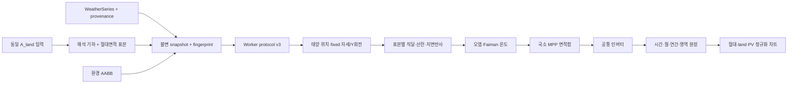

# 3D 태양광 시뮬레이터 아키텍처

기준일: 2026-08-12

## 1. 현재 구조의 핵심 결정

애플리케이션은 vinext/Vite, React, TypeScript, Three.js와 브라우저 Web Worker로 구성된다. 렌더링과 물리 계산은 다음 원칙으로 분리한다.

- Three.js는 형상, 카메라, 선택, helper와 환경 오브젝트를 그린다. WebGL 그림자나 렌더 triangle 면적은 발전량의 원본이 아니다.
- 태양·복사·열·PV·회로·인버터 계산은 React와 Three.js에 의존하지 않는 `src/lib` 순수 함수와 `src/workers`에서 수행한다.
- 동일 토지 **기본 비교**와 **자유 조립·레거시 편집**은 서로 다른 전기 계약을 사용한다.
- 모든 장기 계산은 입력 snapshot과 protocol/cache version을 포함한 fingerprint에 묶는다. 현재 입력과 다른 worker 결과는 폐기한다.
- 내부 물리는 SI 단위와 UTC timestamp를 사용한다. UI는 도·현지시각·kWh 정규화를 표시 경계에서 처리한다.

## 2. 두 시뮬레이션 경로

### 2.1 기본 동일 토지 비교

평면·정육면체·원기둥·구·반구·원뿔은 각각 하나의 `ComparisonSurfaceModel`이다. 형상은 같은 `A_land`를 가지며 `A_PV`는 해석 표면적에서 나온다.

```text
ComparisonSurfaceModel
  └─ one continuousSkinId
     ├─ geometry/reporting regions
     └─ absolute-area quadrature samples: (position, normal, areaM2)
```

`createContinuousSurfaceWorkItem()`은 내부 매개화 영역을 평탄화해 worker protocol v3의 `continuousSurface.samples[]`로 보낸다. 각 `areaM2`는 절대 가중치이고 합은 `A_PV`다. 기본 worker variant에는 panel count, 회로 topology와 전기 공정성 mode가 없다.

```text
Pdc(t) = Σ ηPV(T_i) · POA_i(t) · ΔA_i
Pac(t) = inverter(Pdc(t), idealBusVoltage)
```

이 경로의 ID는 `ideal-continuous-pv-v1`, 전기 계약은 `local-mpp-area-integral`이다. `surface`, cylinder `top/lateral`, cube face는 결과 귀속용 영역이며 전기 소자가 아니다. mismatch와 bypass는 모델에 없으므로 0이다.

### 2.2 자유 조립·레거시 경로

자유 조립은 `0.05 m × 0.05 m` 강체 패널 1~20장, 사용자 회로, 직렬·병렬, 단일 다이오드 I–V, 바이패스와 인버터를 사용한다. 이전 곡면 프로젝트의 20개 등면적 band와 Mode A/B도 호환·진단 경로에서 읽을 수 있다.

이 경로의 `panelCount`, `PANEL_AREA_M2`, `ELECTRICAL_ZONE_COUNT`, `electricalFairnessMode`는 기본 비교 입력으로 승격하지 않는다. 기본 비교 UI가 이 언어를 표시하지 않는지 소스 계약 테스트가 검사한다.

## 3. 주요 모듈 경계

```text
app/
  page.tsx, layout.tsx                 # 서버 셸과 메타데이터
src/ui/
  SimulatorClient.tsx                  # 화면 상태, 시나리오 조립, worker 제어
  LandComparisonControls.tsx           # 동일 A_land 전용 입력
  ThreeWorkspace.tsx                   # Three 렌더·선택·helper
src/lib/geometry/
  comparison-surfaces.ts               # 동일 토지 치수·footprint·연속 표본
  continuous-surfaces.ts               # 공통 해석 곡면과 레거시 곡면
  presets.ts                            # 자유 조립/이전 프리셋 anchor
src/lib/physics/
  pipeline.ts                           # 태양→POA→온도→PV→인버터 순간 경로
  continuous-surface.ts                # 순간 연속 스킨과 호환 회로 진단
  irradiance.ts, thermal.ts, pv.ts      # 단계별 순수 모델
src/lib/compare/
  performance.ts, reflectors.ts         # 이중 정규화·반사 예산
src/workers/
  protocol.ts                           # v3 구조, fingerprint/cache version
  kernel.ts                             # annual/time-series 계산
  simulation.worker.ts                  # 브라우저 메시지 진입점
src/lib/project/, src/lib/weather/       # 저장·migration, 날씨 repository/fallback
```

UI는 계산식을 복제하지 않고 계산 결과와 모델 descriptor를 렌더한다. 형상별 multiplier나 목표 순위 보정값은 어느 단계에도 두지 않는다.

## 4. 좌표와 면적 불변식

- Three.js와 물리는 `+X=동`, `+Y=위`, `+Z=북`을 공유한다.
- 방위각은 북 0°, 동 90°이고 태양벡터는 `(cosα sinγ, sinα, cosα cosγ)`다.
- 표면 법선은 바깥쪽 단위벡터이며 `n·s≤0`인 한쪽 면에는 직달광이 없다.
- 세계 Y축 회전은 위치와 법선에 같은 변환을 정확히 한 번 적용한다.
- 기본 여섯 형상의 실제 `XZ` 투영 합집합은 공통 `A_land`이고 면적지수는 100이다.
- 적분 표본은 `ΣΔA=A_PV`를 만족한다. 렌더 mesh의 triangle 수와 표본 수는 무관하다.
- 정적 footprint, swept footprint, tight AABB bounds, 간격 포함 parcel과 순간 `A_sun(t)`를 별도 필드로 보존한다.

기본 평면은 위에서 `L×L`, `L=√A_land`인 정사각 footprint다. 경사방향 실제 길이는 `L/cosβ`, 전체 수직 높이는 `L tanβ`다. 경사 입력은 UI·기하·worker가 같은 0~75° 범위를 사용하며 범위 밖 값을 거부한다. 범위 안의 값이 `H_max`를 넘을 때만 기하가 가능한 최대 경사로 제한한다. 고체 형상의 면적식은 [형상 프리셋](geometry-presets.md)을 따른다.

## 5. 기본 비교 데이터 흐름



단계 순서는 다음과 같다.

1. 비교 입력을 검증하고 여섯 형상의 치수와 표본을 만든다.
2. weather, 위치, 반사, 장애물, fixed 자세/Y회전, 품질과 모델 version을 snapshot에 넣어 fingerprint를 만든다.
3. 각 timestamp에서 표본 위치·법선을 자세에 맞춰 변환한다.
4. 표본마다 AOI, IAM, POA, AABB 직달 가시율, 온도와 국소 DC를 계산한다.
5. 국소 DC를 형상 전체에서 합산하고 공통 인버터를 한 번 적용한다.
6. 원기둥 등의 보고 영역은 같은 합산 scale로 AC를 귀속한다.
7. 구간 전력을 에너지로 적분하고 현지 offset에 맞춰 월 bucket을 나눈다.
8. fingerprint가 현재 UI와 일치하는 결과만 합친다.

## 6. 복사·차폐 경계

POA는 직달, Hay–Davies/등방 하늘 산란과 Lambert 지면반사를 분리한다. cosine과 IAM은 POA에서 한 번만 적용한다. 해석 법선의 sky/ground view factor는 `(1±n_y)/2`다.

장애물은 렌더 object의 변환을 반영한 정적 AABB proxy로 worker에 전달한다. worker는 변환된 표본 위치에서 태양 방향 ray를 쏘며 직달 성분만 가린다. ground와 water는 장애물 목록에서 제외한다. 실제 GLB triangle/BVH, 산란광 sky dome 차폐, penumbra와 다중반사는 현재 기본 경로가 아니다.

인공 반사면을 선택하면 반사 공급이 `ρ·GHI·A_reflector`를 넘지 않도록 geometry-wide scale을 적용한다. `reflectorMode=none`에서도 지정된 지면 albedo의 Lambert 성분은 남는다.

## 7. worker 시간 계약

연간 비윤년 입력은 다음 해 첫 endpoint를 포함해 8,761개 timestamp와 8,760개 구간을 갖는다. closing endpoint가 없거나 큰 gap이 있으면 annual validation이 거부한다.

고정 RPM interval은 완전 회전과 잔여 호를 주기 구적한 평균전력이다. 이미 평균된 왼쪽 행을 구간 에너지에 한 번만 사용한다. 정적 시계열은 사다리꼴 적분한다. cancellation은 chunk 사이와 긴 표본 loop에서 확인하고, progress는 실제 표본·위상 work를 반영한다.

fingerprint에는 protocol/cache, continuous model/mesh, 형상, `A_land`, `A_PV`, 높이, 표본 수·내용, 광학·전기·인버터, 날씨, 장애물과 자세/회전 입력이 포함된다. 이 중 하나가 달라지면 이전 결과를 재사용하지 않는다. UI 수용 경계는 fingerprint뿐 아니라 event를 보낸 worker 객체와 request ID도 현재 active request와 같은지 검사해, 종료된 worker가 브라우저 event loop에 남긴 queued completion을 차단한다.

동일 토지 기본 비교의 평면은 fixed다. 순간마다 XZ projection이 바뀌는 단축·이축 추적은 공통 `A_land` 불변식과 직접 비교할 수 없으므로 별도 설계·레거시 adapter에 격리한다. protocol이 tracking 입력을 지원하더라도 기본 비교 variant 생성기는 이를 보내지 않는다.

## 8. 상태·저장과 UI

편집 문서, 일시 UI 상태와 계산 결과를 구분한다. 프로젝트 JSON과 migration은 자유 조립의 패널·회로, 환경, 공유 입력과 비교 설정을 보존한다. worker handle, progress, hover, 카메라와 stale 결과는 영속 원본이 아니다.

기본 비교 화면은 다음 값만 공정 비교 지표로 사용한다.

- `kWh/year`
- `kWh/m²-land/year = E/A_land`
- `kWh/m²-PV/year = E/A_PV`
- `A_land`, 면적지수, `A_PV/A_land`, 높이, `A_sun(t)`

세 단위는 별도 차트에 둔다. 단위가 다른 절대 Wh와 Wh/m²를 같은 Y축에 섞지 않는다. 모든 `A_land`가 같으므로 절대값과 land 정규화의 순위·상대비율이 다르면 버그다.

## 9. 검증 전략

검증은 다음 층으로 나뉜다.

- 순수 물리: 태양, AOI/IAM, POA, 온도, PV, 인버터, 밤 0
- 해석 기하: `A_land`, `A_PV`, 법선, 투영, 회전 불변, 구적 수렴
- worker: protocol v3, 절대면적 합, local-MPP, closing endpoint, progress/cancel/stale
- UI 소스 계약: 기본 비교에 discrete panel/Mode A/B 언어와 필드가 없음
- 브라우저 수동 검증: 실제 8,760시간 완료, DOM 결과, 원기둥 영역 폐합
- production: typecheck, lint, build와 HTML smoke

현재 명령 상태와 실제 수치는 [검증 결과](validation-report.md), 모델 이상화는 [알려진 한계](known-limitations.md)를 따른다.
