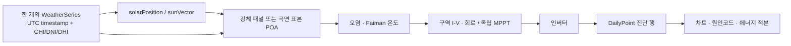

# 시간대별 출력과 입사각 진단 계약

## 목적

시간 그래프의 dropout이나 spike는 후처리 smoothing으로 숨기지 않는다. 각 시점의 원본 시간, 기상, 태양 위치, 광학, 회로와 인버터 상태를 같은 계산 경로에서 보존하고, 급변 원인을 분류한다. 18시라는 시각만으로 오류를 판정하지 않는다. 해당 날짜와 위치에서 태양 고도가 양수이고 복사 입력이 있으면 저녁 발전은 정상일 수 있다.

## 단일 데이터 흐름

각 시간점은 공급자 원본 timestamp, 정규화된 UTC ISO, 현지시각 표시값, 기상 provenance를 함께 가진다. UTC millisecond가 계산과 정렬의 기준이고 현지시각은 표시를 위해 한 번만 변환한다. `WeatherSeries`는 중복 없는 오름차순 timestamp와 유한·비음수 복사량을 입력 경계에서 검증한다.

일간 경로는 현재 10분 간격으로 동일 시점의 태양 위치와 기상점을 사용한다. 월 대표일과 연간 worker는 별도 시간 해상도를 사용하므로 일간 차트의 점 개수와 동일하다고 가정하면 안 된다.

## 날씨 단일-source 정책

한 요청 시간축 안에서 API/파일 자료와 오프라인 맑은하늘 자료를 점별로 이어 붙이지 않는다. 선호 `WeatherSeries`가 요청한 모든 timestamp를 직접 또는 허용된 보간 간격으로 덮으면 전 구간에서 그 자료만 사용한다. 한 점이라도 덮지 못하면 전 구간을 하나의 결정론적 오프라인 series로 다시 만들고 `fallbackReason`에 이유를 남긴다.

이 정책은 자료 경계가 물리적 dropout과 저녁 spike처럼 보이던 현상을 제거한다. 공급자 자료의 실제 급변은 보존하며 `WEATHER_STEP`으로 진단할 뿐 값을 평활화하지 않는다. 수동 GHI/DNI/DHI는 순간 계산 전용이며 일간·월간·연간 series를 합성하지 않는다.

## POA와 각도 손실

직달 성분은 다음과 같다.

\[
G_{direct,POA}=DNI\;V_{sun}\;\eta_{cos}\;IAM
\]

\[
\eta_{cos}=\max(0,\hat n\cdot\hat s),\qquad
\eta_{angle}=\eta_{cos}\,IAM
\]

`ηcos`, IAM과 직달 가시율은 각각 한 번만 적용한다. POA에서 계산한 `effectivePoaWm2`를 DC 모델에 전달한 뒤 `cos(AOI)`나 IAM을 다시 곱하지 않는다. 총 POA는 직달, 하늘 산란과 지면 반사의 합이다.

\[
G_{POA}=G_{direct,POA}+G_{diffuse,POA}+G_{ground,POA}
\]

좌표는 `+X=동`, `+Y=위`, `+Z=북`, 방위각 0°=북·90°=동이다. 태양 벡터는 다음 규약을 따른다.

\[
\hat s=(\cos\alpha\sin\gamma,\;\sin\alpha,\;\cos\alpha\cos\gamma)
\]

태양 고도 `α ≤ 0°`이면 직달 입력과 발전 출력은 0으로 강제한다. GHI 세 성분은 값을 수정하지 않고 다음 폐합 잔차를 기록한다.

\[
GHI_{reconstructed}=DNI\max(0,\cos\theta_z)+DHI
\]

\[
r_{GHI}=GHI-GHI_{reconstructed}
\]

## 곡면 적분과 Mode A·B

구·원기둥·원뿔의 AOI는 구역 대표 법선 하나로 계산하지 않는다. 각 등면적 구역의 표면 표본마다 법선, `n·s`, IAM, 직달·산란·지면반사 POA, 외부 가시율과 온도를 계산하고 면적 가중 적분한 뒤 구역 I–V 곡선을 만든다.

- Mode A(`shared-circuit`)는 동일 회로·바이패스·인버터에서 실제 mismatch를 포함한다.
- Mode B(`independent-mppt`)는 구역별 MPP를 합산해 mismatch와 바이패스를 제거한 광학 상한을 보여 준다.

두 값의 차이는 투영면적 때문에 생긴 형상 차이와 회로 불일치를 구분하는 데 사용한다. 손실 원장은 투영, IAM, 외부 차폐, 자체 차폐, 오염, 온도·PV 모델, mismatch, 바이패스, 인버터 항목을 중복 차감 없이 기록한다.

## 회전 구간 적분

RPM이 0이면 정적 계산과 같은 pose와 결과를 사용한다. 고정 RPM의 한 시간 구간은 완전 회전 수와 남은 호를 주기적 위상 구적법으로 면적 평균한다. 이 행의 전력은 이미 `[t_i,t_{i+1}]`의 구간 평균이므로 에너지 적분에서는 왼쪽 행의 평균에 구간 길이를 한 번만 곱한다. 정적 행에는 사다리꼴 적분을 사용한다.

위상 표본을 임의 상한으로 잘라 수백 회전을 몇 개 timestamp의 순간값으로 대신하지 않는다. `ROTATION_PHASE`는 구간 위상평균을 사용했다는 감사 표식이며 오류가 아니다.

곡면 표본 위치, 법선과 차폐 좌표는 같은 월드 Y 회전을 받는다. 축대칭 곡면의 장애물 없는 총 투영면적은 Y 회전에 불변이며, 화면에서 mesh와 helper가 다시 회전해 이중 변환하지 않아야 한다.

## 원인코드

분류기는 원본 값을 변경하지 않고 표시용 코드와 `normal / attention / error` 심각도만 만든다.

| 코드 | 판정 의미 | 기본 심각도 |
|---|---|---|
| `NIGHT` | 태양 고도 0° 이하 | normal |
| `NORMAL_SUNSET` | 정오 이후 태양고도 25° 이하에서 태양·GHI·AC가 함께 감소하는 정상 일몰 | normal |
| `WEATHER_STEP` | 연속점 GHI 변화가 절대 120 W/m² 이상이고 상대 35% 이상 | attention |
| `INVERTER_CUTOFF` | DC는 양수지만 AC가 0이고 인버터가 off/cutoff/MPPT 제한 상태 | attention |
| `BYPASS_SWITCH` | 연속점 사이 바이패스 도통 개수 변화 | attention |
| `STRING_CURRENT_LIMIT` | 인버터 상태가 current-limit | attention |
| `OCCLUSION_CHANGE` | 면적가중 직달 가시율이 0.2 이상 변화 | attention |
| `ROTATION_PHASE` | 해당 행이 회전 구간 평균 | normal |
| `MISSING_DATA` | 원본 자료 누락 플래그 | error |
| `STALE_WORKER_RESULT` | 현재 fingerprint와 다른 worker 결과 | error |
| `NUMERIC_ERROR` | 진단 신호에 NaN 또는 Infinity가 있음 | error |

`low-load-cutoff`은 양의 DC가 있어도 인버터 기동전력 아래에서 AC가 0인 물리 상태를 `INVERTER_CUTOFF`으로 구분한다. worker 결과는 fingerprint가 일치하지 않으면 차트 상태에 합치기 전에 폐기한다.

현재 일간 `DailyPoint`에는 원본/UTC/현지 timestamp, 태양 고도·방위·천정각, GHI/DNI/DHI, 선택 구역 AOI·cosine·IAM·POA 성분·온도·DC, 시스템 전압·전류, 바이패스 수, 인버터 상태, 두 공정성 모드 결과와 원인코드가 저장된다. `MISSING_DATA`와 `STALE_WORKER_RESULT`는 분류 계약에는 있으나 각각 입력 검증/worker 경계에서 먼저 차단되는 경로가 있어 일반 일간 행에서는 보통 나타나지 않는다.

## 그래프 진단 UI 상태

일간 차트 계열은 태양 고도, AOI, `ηcos`, IAM, `ηangle`, GHI/DNI/DHI, POA, DC와 AC를 개별 토글한다. 선은 `linear` 보간을 사용해 renderer가 표본 사이에 새로운 극값을 만들지 않는다. 사용자가 차트 점을 클릭하면 선택 시각의 원본/UTC/현지 timestamp, 태양·기상, DC/AC·누적 Wh, 전압·전류·인버터·가시율, Mode A·B, 원인코드 설명과 구역별 AOI/POA/온도/I–V/바이패스 표가 표시된다. 이 상호작용의 브라우저 자동 테스트는 아직 없다.

## 자동화된 회귀 계약

- AOI 0°/60°/90°/뒷면, DNI 선형성, GHI 폐합과 cosine·IAM 단일 적용
- 밤 출력 0, 입력 0에서 유한한 0 출력, 인버터 저부하 차단 상태
- RPM 0과 정적 일치, 고RPM 위상 적분 수렴, 구간 평균 에너지의 중복 적분 방지
- 공급된 GHI/DNI/DHI 우선 사용과 과거 `sin(elevation)`/`sqrt` 재형상화 금지
- timestamp 경계, worker 취소·fingerprint·stale 결과 차단
- 정상 일몰과 입력/차폐/바이패스/인버터 급변 원인코드 분류
- 서울 하지·춘분·동지의 5/10분 맑은 날 시계열 길이·정렬·중복 및 무원인 단일점 spike/dropout 검사

연속 곡면 적분의 별도 수렴 범위와 아직 자동화되지 않은 항목은 [검증 결과](validation-report.md)에 기록한다.
