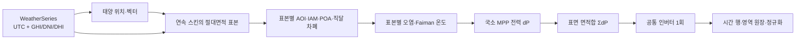

# 시간대별 출력과 입사각 진단 계약

## 목적

시간 그래프의 dropout이나 spike는 smoothing으로 숨기지 않는다. 각 시점의 원본 timestamp, 기상, 태양 위치, 광학, 온도, 전기와 인버터 상태를 같은 계산 경로에서 보존해 원인을 분류한다. 특정 시각, 예를 들어 18시라는 이유만으로 오류를 판정하지 않는다. 해당 날짜·위치에서 태양 고도와 복사 입력이 양수이면 저녁 발전은 정상일 수 있다.

## 기본 비교의 단일 데이터 흐름

기본 동일 토지 비교는 이 경로에서 형상당 `continuousSurface` 하나만 worker에 보낸다. 20개 panel/zone, `N_eq`, 동일 활성면적, Mode A/B, 직렬·병렬 회로와 bypass는 사용하지 않는다. `surface`, 원기둥 `top/lateral`, 정육면체 face 같은 ID는 결과를 설명하기 위한 영역일 뿐 전류를 제한하는 전기 구역이 아니다.

자유 조립과 이전 프로젝트의 상세 시뮬레이션은 별도 `panels[] → I–V → circuit/bypass → inverter` 경로를 유지한다. 이 경로의 Mode A/B와 구역 상태를 기본 비교 결과의 원인으로 인용하지 않는다.

## 시간과 날씨 단일-source 정책

각 행은 공급자 원본 timestamp, 정규화 UTC ISO, 현지 표시시각과 기상 provenance를 함께 가진다. UTC millisecond가 정렬·태양위치·적분의 기준이고 현지시각은 표시와 월 bucket 경계를 위해 한 번만 변환한다. `WeatherSeries`는 중복 없는 오름차순 timestamp와 유한·비음수 복사량을 입력 경계에서 검증한다.

한 요청에서 API/파일 자료와 offline 자료를 점별로 이어 붙이지 않는다. 선호 series가 요청 전체 timestamp를 덮으면 그 자료만 사용하고, 한 점이라도 허용 범위를 벗어나면 전체 구간을 하나의 결정론적 offline series로 다시 만든 뒤 `fallbackReason`을 기록한다. 이 정책은 자료 경계가 물리적 dropout이나 저녁 spike처럼 보이는 일을 피한다. 공급자 자료 자체의 급변은 보존하고 `WEATHER_STEP`으로 진단한다.

수동 GHI/DNI/DHI는 순간 계산용이다. 기본 상태가 수동 순간값이어도 연간 실행은 `buildAutomaticWeather()`가 만든 완결된 시계열을 사용한다. 일간 그래프는 10분, 대표일 추정은 월별 대표일, 실제 연간 worker는 시간 경계 구간을 사용하므로 점 개수와 결과를 동일시하지 않는다.

## POA와 각도 손실

직달 성분은 다음과 같다.

\[
G_{direct,POA}=DNI\;V_{sun}\;\eta_{cos}\;IAM
\]

\[
\eta_{cos}=\max(0,\hat n\cdot\hat s),\qquad
\eta_{angle}=\eta_{cos}IAM
\]

`ηcos`, IAM과 직달 가시율은 각각 한 번만 적용한다. POA에서 얻은 `effectivePoaWm2`를 DC 모델에 전달한 뒤 cosine이나 IAM을 다시 곱하지 않는다.

\[
G_{POA}=G_{direct,POA}+G_{diffuse,POA}+G_{ground,POA}
\]

좌표는 `+X=동`, `+Y=위`, `+Z=북`, 방위각 0°=북·90°=동이다.

\[
\hat s=(\cos\alpha\sin\gamma,\;\sin\alpha,\;\cos\alpha\cos\gamma)
\]

태양 고도 `α≤0°`이면 공급 자료에 양의 복사량이 잘못 남아 있어도 POA와 DC/AC를 정확히 0으로 만든다. 낮에는 공급된 세 성분을 수정하지 않고 GHI 폐합 잔차를 감사값으로 남긴다.

\[
r_{GHI}=GHI-[DNI\max(0,\cos\theta_z)+DHI]
\]

## 연속 스킨의 입사각 적분

대표 법선 하나를 형상 전체에 적용하지 않는다. 표본 `i`마다 위치, 해석 법선, AOI, IAM, POA 성분, 외부 직달 가시율과 온도를 계산한다.

\[
P_{DC}(t)=\sum_i \eta_{PV}(T_i)G_{effective,i}\Delta A_i,
\qquad \sum_i\Delta A_i=A_{PV}
\]

이는 `local-mpp-area-integral`이며 미소 면적 사이의 회로 mismatch가 없는 이상 상한이다. 기본 비교에서 mismatch와 bypass가 항상 0인 이유는 손실이 작게 계산됐기 때문이 아니라 해당 회로 요소가 모델에 없기 때문이다. 국소 DC 합에 공통 인버터를 한 번 적용하므로 inverter cutoff, current limit과 clipping은 여전히 spike/dropout 후보가 될 수 있다.

원기둥 윗면·옆면의 순간/연간 값은 같은 표본 적분을 `regionId`로 합친 원장이다. 영역 합은 전체 DC·AC와 닫혀야 하며, 경계에서 별도 전기 전이가 생겨서는 안 된다.

## 자유 조립·레거시 회로 진단

자유 조립에는 다음 진단이 계속 적용된다.

- `shared-circuit`: 패널/이전 전기 구역의 공용 회로, mismatch와 bypass 포함
- `independent-mppt`: 구역별 MPP를 합산하는 이전 상한 비교

이 두 값은 사용자가 만든 회로의 영향을 분석하기 위한 것이며 기본 형상 비교의 두 결과가 아니다. 이전 UI의 Mode A/B snapshot이나 20구역 표를 새 동일 토지 결과와 비교할 때는 모델·면적·worker fingerprint를 먼저 확인한다.

## 회전과 별도 추적 경로

RPM이 0이면 정적 pose와 결과를 사용한다. 고정 RPM의 한 시간 구간은 완전 회전과 남은 호를 주기적 위상 구적법으로 평균한다. 이 행의 전력은 이미 `[t_i,t_{i+1}]` 평균이므로 에너지 적분에서는 왼쪽 행의 평균에 구간 길이를 한 번만 곱한다. 정적 행에는 사다리꼴 적분을 사용한다.

표본 위치, 법선과 장애물 ray 원점은 같은 월드 Y 변환을 정확히 한 번 받는다. 구·반구·원기둥·원뿔은 축대칭이므로 장애물이 없는 균일 환경에서는 Y축 회전으로 전체 출력이 변하지 않아야 한다. 비대칭 AABB 장애물이 있으면 회전 의존성은 정상이다.

동일 토지 기본 비교의 평면은 fixed다. 단축·이축 평면 추적은 순간 XZ projection과 토지 envelope 정의가 달라지는 별도 설계·레거시 경로이며 기본 형상 순위에 합치지 않는다. 별도 tracking adapter를 실행할 때만 표면 위치와 법선을 같은 중심점에서 갱신하고, 태양이 지평선 아래이면 상향 stow 자세와 출력 0을 사용한다.

## 원인코드

분류기는 원본 값을 바꾸지 않고 표시용 코드와 `normal / attention / error` 심각도만 만든다.

| 코드 | 판정 의미 | 기본 심각도 |
|---|---|---|
| `NIGHT` | 태양 고도 0° 이하 | normal |
| `NORMAL_SUNSET` | 정오 이후 낮은 태양고도에서 태양·GHI·AC가 함께 감소 | normal |
| `WEATHER_STEP` | 연속점 GHI가 절대 120 W/m² 이상, 상대 35% 이상 변함 | attention |
| `INVERTER_CUTOFF` | DC는 양수지만 AC가 0이고 인버터가 off/cutoff/MPPT 제한 | attention |
| `BYPASS_SWITCH` | 자유 조립 회로의 bypass 도통 개수 변화 | attention |
| `STRING_CURRENT_LIMIT` | 자유 조립/인버터 경로의 current limit | attention |
| `OCCLUSION_CHANGE` | 면적가중 직달 가시율이 0.2 이상 변함 | attention |
| `ROTATION_PHASE` | 해당 행이 회전 구간 평균 | normal |
| `MISSING_DATA` | 원본 자료 누락 플래그 | error |
| `STALE_WORKER_RESULT` | 현재 fingerprint와 다른 worker 결과 | error |
| `NUMERIC_ERROR` | 진단 신호에 NaN 또는 Infinity가 있음 | error |

기본 연속 스킨에서는 `BYPASS_SWITCH`가 발생해서는 안 된다. 발생하면 기본 worker가 레거시 panel/circuit 입력을 잘못 받은 것으로 본다. `low-load-cutoff`은 양의 DC가 있어도 인버터 기동전력 아래에서 AC가 0인 정상적인 전기 상태일 수 있다.

## 그래프와 감사 UI

일간 차트는 태양 고도, AOI, `ηcos`, IAM, `ηangle`, GHI/DNI/DHI, POA, DC와 AC를 별도 토글한다. 선은 `linear` 보간을 사용해 renderer가 표본 사이에 새 극값을 만들지 않는다. 점을 선택하면 원본/UTC/현지 timestamp, 태양·기상, 전압·전류·인버터·가시율과 원인코드를 표시한다.

자유 조립 상세 화면에는 회로와 panel/zone 표가 추가될 수 있다. 기본 동일 토지 비교 카드는 연간 절대 AC, 두 면적 정규화, `A_sun(t)`와 원기둥 영역 원장을 보여 주며 20구역·Mode A/B를 표시하지 않는다.

## 회귀 계약

- AOI 0°/60°/90°/뒷면, DNI 선형성, GHI 폐합과 cosine·IAM 단일 적용
- 기본 연속 스킨의 절대면적 합, 국소 MPP 적분과 mismatch/bypass 0
- 밤의 POA·DC·AC 정확한 0, 유한성, 결정론
- 공급된 GHI/DNI/DHI 우선과 과거 `sin(elevation)`/`sqrt` 재형상화 금지
- RPM 0 정적 일치, 고RPM 위상 수렴과 구간 에너지 중복 적분 방지
- timestamp 경계, worker 취소·fingerprint·stale 결과 차단
- 정상 일몰과 기상·차폐·인버터 급변 원인코드
- 평활화 없는 시계열의 무원인 단일점 spike/dropout 검사

연간 브라우저 결과와 레거시 수치의 정확한 차이는 [동일 토지 비교 보고서](land-area-comparison-report.md), 자동화 상태는 [검증 결과](validation-report.md)를 따른다.
